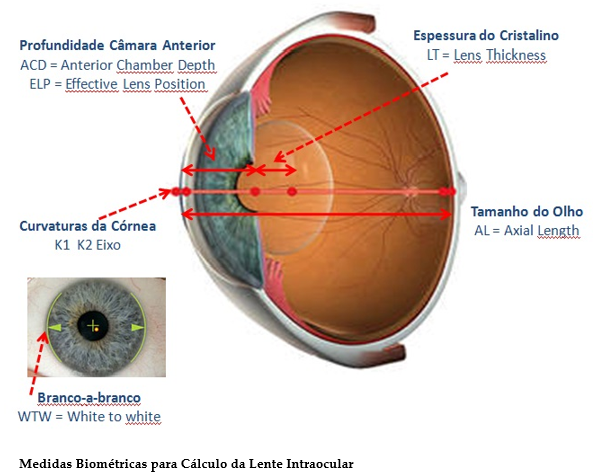
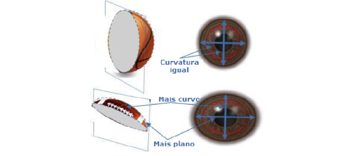
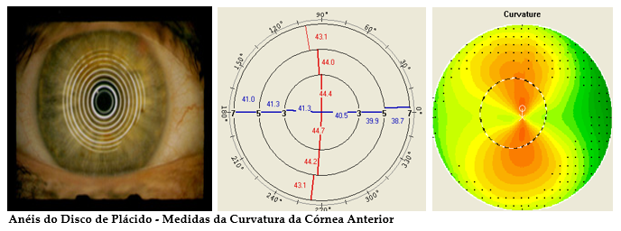

# PPGI038
PPGI038 - BOAS PRÁTICAS EM APRENDIZAGEM DE MÁQUINA

O dataset `barrettII_eyes_clustering.csv` contém cerca de 1500 amostras com as seguintes variáveis

- AL = comprimento axial do olho
- ACD = profundidade de câmara anterior
- WTW = distância branco a branco
- K1 = curvatura no meridiano menos curvo
- K2 = curvatura no meridiano mais curvo

Uma variável dependente ("Correto") define se a amostra representa um olho normal ou não. 

Mais informações em [Biometria Ocular](https://draandreia.com.br/?page_id=1027).

Em resumo, o link acima detalha a importância da biometria ocular, que mede características anatômicas do olho, essenciais para cálculos em cirurgias de catarata, por exemplo. Segue uma breve descrição das variáveis contidas no dataset:

- **AL (Comprimento Axial do Olho)**: Refere-se ao comprimento total do olho, importante para determinar o poder de refração necessário em lentes intraoculares.
- **ACD (Profundidade da Câmara Anterior)**: Distância entre a córnea e o cristalino, relevante para o posicionamento de lentes intraoculares.
- **WTW (Distância Branco a Branco)**: Medida horizontal da córnea, útil para ajustar o tamanho de dispositivos intraoculares.
- **K1 e K2 (Curvaturas Corneais)**: Refletem as curvaturas nos meridianos menos e mais curvos da córnea, essenciais para entender as condições refrativas do olho.

Essas medidas são fundamentais para cálculos precisos na oftalmologia, especialmente em procedimentos que alteram a óptica ocular.

---

A córnea normalmente apresenta um formato semelhante ao de uma bola de basquete, com curvatura semelhante em todos os meridianos. Quando há diferença entre os meridianos, ou seja, um é mais curvo e outro é mais plano, semelhante a uma bola de futebol americano, temos o astigmatismo. O astigmatismo também pode ser causado pelo cristalino.

Mais detalhes [aqui](http://www.bogonioftalmologia.com.br/web/doencas-astigmatismo.php).

---

Mais detalhes [aqui](https://www.draandreia.com.br/?page_id=1024).

